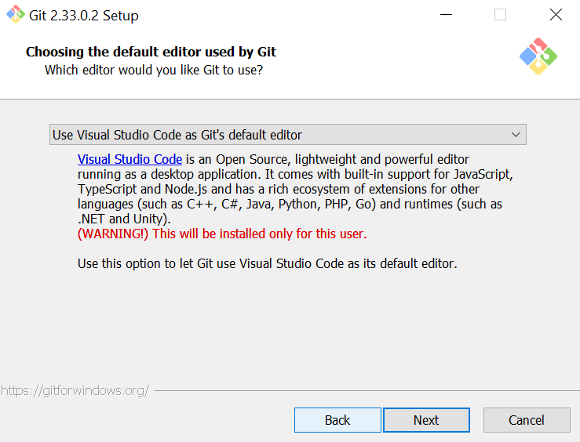
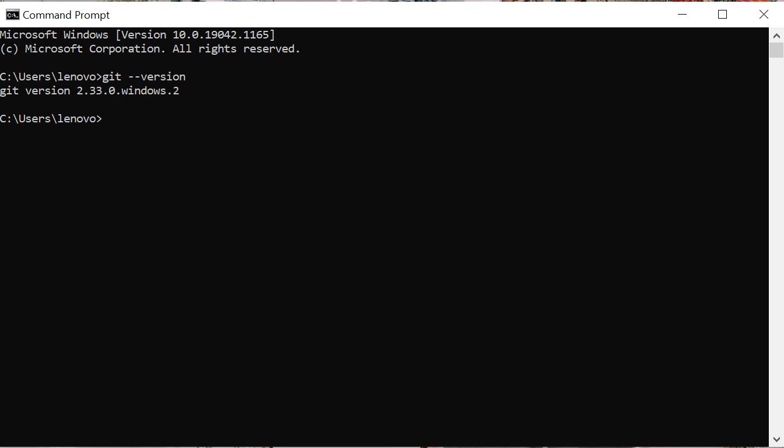
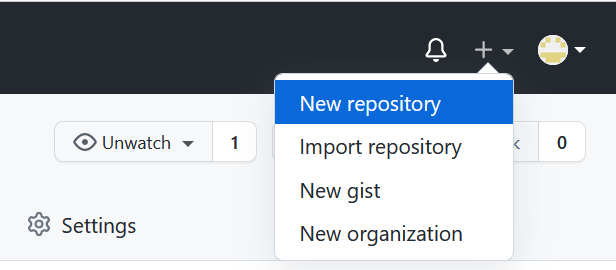

 # 01-git-github 

 # Langkah - Langkah Instalasi Git di Windows 
Sebelum Instal Git di Windows, kita harus mempunyai teks editor yang di dukung oleh windows. Seperti Visual Studio Code, Notepad++, textpad, dll.

1. Downlaoad Git sesuai dengan sistem operasi di komputer masing - masing di https://git-scm.com/downloads

2. Setelah download selesai, buka file hasil download. Setelah itu akan muncul lisensi seperti dibawah ini. Klik **Next**.

3. Pilih lokasi instalasi. Secara otomatis lokasi di C:\Program Files\Git. Ganti lokasi jika menginginkan lokasi lain. Kemudian klik **Next**.

4. Pilih komponen sesuai default. Kemudian klik **Next**.

5. Di bagian select start menu folder diminta untuk memasukan pemilihan directory start menu, di bagian ini bisa merubah atau membiarkan secara default disini saya mengikuti bawaan nya (Default) dan kemudian **Next**.

6. Pilih editor yang akan digunakan dengan Git. Disini saya menggunakan Visual Studio Code. Kemudian klik **Next**

7. Di bagian menu **Adjusting your Path Environment** pilih yang kedua agar perintah git dapat dikenali dengan mudah oleh Command Prompt (CMD). Setelah itu klik **Next**.

8. Setelah itu di bagian **Choosing HTTPS Transport Backend** terdapat 2 pilihan yaitu Use The OpenSSL library dan Use the native windows secure Channel library, pilih use the openssl library. Kemudian klik **Next**.

9. Selanjutnya pada bagian **configuring the line ending conversion** mengikuti bawaan (default) kemudian klik **Next**.

10. Pilih Use Window’s default console window kemudian klik **Next**.

11. Selanjutnya di menu **Choose the default behavior of ‘git pull’** pilih default (fast-forward of merge) kemudian klik **Next**.

12. Pilih yang kedua atau git credential manager core kemudian kamu klik **Next**.

13. Selanjutnya pada bagian **Configuring Extra Options** terdapat 2 pilihan, Enable file system caching dan enable symbolic links. Pilih Enable file system caching, kemudian klik **Next**.

14. Pilih keduanya enable exprimental support for pseudo consoles dan enable exprimental built-in file system monitor. Kemudian klik **Instal**.

15. Setelah itu tunggu proses instalansi

16. Setelah selesai proses instalansi akan muncul dialog pemeberitahuan **Completing the Git Setup Wizard**. Kemudian klik **Finish**.

17. Untuk menjalankannya, klik Search pada Start menu, ketikkan "Git", kemudian akan muncul beberapa pilihan. Pilih "Git Bash" atau "Git GUI".

18. Tampilan jika akan menggunakan "Git Bash"

19. Tampilan jika akan menggunakan "Git GUI"

20. Untuk mencoba dari command prompt, masuk ke command prompt, setelah itu eksekusi "git --version" untuk melihat apakah sudah terinstall atau belum. Jika sudah terinstall dengan benar, maka akan muncul berikut:

# Langkah - Langkah Konfigurasi Git 
Konfigurasi ini akan disimpan di C:\Document and Settings\NamaUser dengan nama file .gitconfig. Ada 2 hal yang perlu dikonfigurasi yaitu username dan email. Gunakan perintah berikut:

$ git config --global user.name "Nama Anda di GitHub"
$ git config --global user.email email@domain.tld

Isikan sesuai dengan nama dan alamat email yang akan digunakan untuk mendaftar di GitHub. Untuk melihat konfigurasi yang sudah ada bisa menggunakan perintah berikut : 

$ git config --list
user.email=oktiadwihapsari@gmail.com
user.name=Oktiaa
color.ui=true
$

Hasilnya seperti dibawah ini :

Langkah ini dilakukan hanya sekali saja, kecuali jika ingin mengubah nama dan email.

# Mengelola Repo Sendiri di Account Sendiri

1. Setelah Login ke GitHub klik tanda "+" dan pilih New Repository

2. Isikan Repository Name dengan nama **01-git-github**, jika nama sudah pernah digunakan maka akan muncul tulisan **01-git-github already exist on this account**. Description optional bisa diisi atau tidak, tetapi disini saya mengisi description dengan **01-git-github**, disini lisesnsi saya kosongkan. Kemudian pilih public.

3. Klik Create Repository, setelah itu akan muncul seperti berikut :

4. Setelah itu, buka komputer lokal untuk melakukan clone. Disini saya meletakkan di directory C.
5. Klik pada bagian kosong di directory C, kemudian klik git bash here

6. Setelah itu gunakan perintah "$ git clone https://github.com/Oktiaa/01-git-github.git", akan muncul seperti gambar dibawah :

7. Dan akan muncul folder dengan nama yang sama dengan nama repository yang dibuat 

8. Setelah itu klik sekali folder tersebut dan pilih git bash here

9. Setelah itu menampilkan file README.md di dalam folder menggunakan perintah seperti dibawah :

10. File README.md akan muncul di dalam folder 

11. Lanjutkan dengan menuliskan perintah di git bash $ git init untuk melakukan inisialisasi dalam direktori.

12. Selanjutnya gunakan perintah $ git add README.md untuk create file README.md, setelah itu akan muncul seperti dibawah :

13. Gunakan perintah $ git commit -m "first commit", fungsi nya supaya orang lain bisa memberikan komentar atau konfirmasi update di dalam file README.md tersebut

14. Langkah selanjutnya, gunakan perintah $ git branch -M main. Karena saat ini terjadi perubahan istilah menjadi main, bukan lagi master. Oleh karena itu, perlu dibuat perubahan setelah membuat repo karena Git lokal masih menggunakan istilah master.

15. Gunakan perintah $ git remote add origin https://github.com/Oktiaa/01-git-github.git fungsi nya untuk mengupload file yang sudah di buat di dalam komputer.

16. Selanjutnya gunakan perintah $ git push -u origin main untuk meng upload ke github 

17. Selanjutnya login untuk melanjutkan proses push githu, jika login berhasil maka di command prompt akan muncul tulisan seperti di bawah ini: 

18. Buat langkah-langkah di dalam file README.md 

